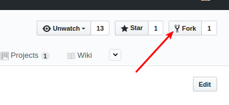

How to change the submission flow
=================================

To change the submission flow, first, you will need to fork bireme's repository to your own repository, so you can edit the code
and steel sync with the main code and updates that will be made in Proethos' code. After this, you can create new custom
fields with any problem.


Preparing Github and Repos structure and flow
---------------------------------------------

1. Fork the Bireme's repository to your own profile:



2. Clone the forked repo to your machine:


```
git clone git@github.com:moacirmoda/proethos2.git
```

3. Access your forked repo and create a new branch to separate your custom from the master branch: (in this case we use
the "customization" in branch name. You can use any name.)
```
cd proethos2
git checkout -B customization
```

4. Come back to the master branch and add the Bireme's repo to your fork:
```
git checkout master
git remote add upstream https://github.com/bireme/proethos2
git fetch upstream
```

5. Now, we recommend that you update and merge periodically, or even that Bireme shares a new version from Proethos2.
You will need to merge your master branch with our master branch, and merge your master branch with your custom branch.
To do this, execute the following command:
```
# merging masters
git checkout master
git merge upstream/master

# merging master with your custom branch
git checkout customization
git merge master
```
Possibly will have conflitcs that you will need to resolve editing the files. But it's not a big deal.

Changing the submission flow
----------------------------

To change the submission flow, you will need to create a new step in `NewSubmissionController.php` and link this new
step with the others. So, let's go!

# Creating the new step in `NewSubmissionController.php`

We will create a new step based on fifth step:
```
/**
 * @Route("/submission/new/{submission_id}/additional", name="submission_new_additional_step")
 * @Template()
 */
public function AdditionalStepAction($submission_id)
{
    $output = array();
    $request = $this->get('request_stack')->getCurrentRequest();
    $session = $request->getSession();
    $translator = $this->get('translator');
    $em = $this->getDoctrine()->getManager();

    $submission_repository = $em->getRepository('Proethos2ModelBundle:Submission');
    $user_repository = $em->getRepository('Proethos2ModelBundle:User');

    $user = $this->get('security.token_storage')->getToken()->getUser();

    // getting the current submission
    $submission = $submission_repository->find($submission_id);
    $output['submission'] = $submission;

    if (!$submission or $submission->getCanBeEdited() == false) {
        if(!$submission or ($submission->getProtocol()->getIsMigrated() and !in_array('administrator', $user->getRolesSlug()))) {
            throw $this->createNotFoundException($translator->trans('No submission found'));
        }
    }

    $allow_to_edit_submission = true;
    // if current user is not owner, check the team
    if ($user != $submission->getOwner()) {
        $allow_to_edit_submission = false;

        if(in_array('administrator', $user->getRolesSlug())) {
            $allow_to_edit_submission = true;

        } else {
            foreach($submission->getTeam() as $team_member) {
                // if current user = some team member, than it allows to edit
                if ($user == $team_member) {
                    $allow_to_edit_submission = true;
                }
            }
        }
    }
    if (!$allow_to_edit_submission) {
        throw $this->createNotFoundException($translator->trans('No submission found'));
    }

    return $output;
}
```

This code was basically copied from function `FifthStepAction()`. This only shows an HTML simple page and allow to send
the next step.

If we try to access the url in browser now, we will receive an error message:

> Unable to find template "Proethos2CoreBundle:NewSubmission:AdditionalStep.html.twig".

This error occur because we don't create an HTML template to answer for this controller yet. So, let's do this.

# Creating the new template file

Create an file called `AdditionalStep.html.twig` in `symphony/src/Proethos2/CoreBundle/Resources/views/NewSubmission`
directory with this content:

```


New submission


    <div class="container-fluid main-content">
        <div class="row">
            <div class='col-md-12'>
                <h1 class="page-header">New submission</h1>
            </div>
        </div>

        

        <div class='new-submission-tab-content'>
            <form class='form' method='POST' action='{{ path("submission_new_fifth_step", {submission_id: submission.id}) }}'>

                <p>Hello World!</p>

                <div class='submission-button-controls'>
                    <a href='{{ path("submission_new_sixth_step", {submission_id: submission.id}) }}' class='btn btn-primary'>Next</a>
                </div>
            </form>
        </div>
    </div>


```

Again, this code was basically based on `FifthStep.html.twig` and only show an "Hello World" expression. It has too a
link to the next step on the bottom.

If you try to load the address in your browser now, you will see the page loaded correctly!

# Inserting this new step into flow

Now, to complete our job we need to add this page to the flow. It means __change the next step in fifth step__ and
__add a new tab in top guide__.

Let's open again the `NewSubmissionController.php` file and find the line with this content:

```
return $this->redirectToRoute('submission_new_sixth_step', array('submission_id' => $submission->getId()), 301);
```

It's inside the method called `FifthStepAction` and it's responsible to redirect the user for the next step when he
ends to fill the previous step.

Let's change the address to our new step:
```
return $this->redirectToRoute('submission_new_additional_step', array('submission_id' => $submission->getId()), 301);
```

Now, when we end to fill the fifth step, we are redirected to the additional step.

To end our customization, let's add an additional tab in top guide editing the file `NewSubmission/meta.html.twig`.

Find this three lines:
```
<li role="presentation" class='active'>
    <a href="{{ path('submission_new_fifth_step', {'submission_id': submission.id }) }}" title='Bibliography'>Bibliography</a>
</li>
```

It represents the tab guide to fifth step. We need to duplicate this three lines, changing the name and the link, like
below:
```
<li role="presentation" class='active'>
    <a href="{{ path('submission_new_additional_step', {'submission_id': submission.id }) }}" title='Additional Step'>Additional Step</a>
</li>
```

Look, we've changed `submission_new_fifth_step` for `submission_new_additional_step` in the first and second line and
change the label `Bibliography` for `Additional Step` in second line. Easy? Isn't it?

And, that's it! Now you have a new step in your flow!
