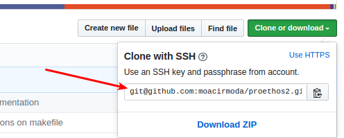

How to create custom fields
==============================

To create new fields, first, you will need to fork bireme's repository to your own repository, so you can edit the code
and steel sync with the main code and updates that will be made in Proethos' code. After this, you can create new custom
fields with any problem.

Preparing Github and Repos structure and flow
---------------------------------------------

1. Fork the Bireme's repository to your own profile:


2. Clone the forked repo to your machine:


```
git clone git@github.com:moacirmoda/proethos2.git
```

3. Access your forked repo and create a new branch to separate your custom from the master branch: (in this case we use
the "customization" in branch name. You can use any name.)
```
cd proethos2
git checkout -B customization
```

4. Come back to the master branch and add the Bireme's repo to your fork:
```
git checkout master
git remote add upstream https://github.com/bireme/proethos2
git fetch upstream
```

5. Now, we recommend that you update and merge periodically, or even that Bireme shares a new version from Proethos2.
You will need to merge your master branch with our master branch, and merge your master branch with your custom branch.
To do this, execute the following command:
```
# merging masters
git checkout master
git merge upstream/master

# merging master with your custom branch
git checkout customization
git merge master
```
Possibly will have conflitcs that you will need to resolve editing the files. But it's not a big deal.

Creating custom fields
----------------------

To create custom fields, you will need to add these field in database, add in the corresponding form, and handle this
new field in controller.

Let's take an example: We will add a new field to submission form, called 'Internal Protocol Number'.

### Adding fields to database
First of all, wi will go to the symfony rootpath:
```
cd symphony/
```

To add fields to the database, you need to add this new field in an entity. All entities of the project are in the
`src/Proethos2/ModelBundle/Entity` path. Each file correspond an one entity.

Go to `Submission.php`, and add a new field before the first method (`public function __construct()` in case):

```
/**
 * @var string`
 *
 * @ORM\Column(name="internal_protocol_number", type="string", length=510)
 */
private $internal_protocol_number;
```

We are adding a new field called `internal_protocol_number` to the `Submission` entity.

After this, we need to create the methods that will handle with this attribute. To do this, execute the following
command:
```
php app/console doctrine:generate:entities Proethos2/ModelBundle/Entity/Submission
```

If all run correctly, you will see this message:

```
Generating entity "Proethos2\ModelBundle\Entity\Submission"
  > backing up Submission.php to Submission.php~
  > generating Proethos2\ModelBundle\Entity\Submission
```

Now we have to create, in fact, this field in database. To do this, we will run the following command:
```
make database_update
```

If all run correctly, you will see this message:
```
php app/console doctrine:schema:update --force
Updating database schema...
Database schema updated successfully! "1" query was executed
```


### Adding field to form

To add any customization in forms, you need to handle with twig files. Twig files are html files with twig login.
All the twig files are related to a controller function. All controllers are in `src/Proethos2/CoreBundle/Controller`.
Each file correspond an one controller. The twig files are located in views directory, in
`src/Proethos2/CoreBundle/Resources/views`. Each directory below this path correspond to the templates of one controller.

In our case, we will edit the `NewSubmission/SecondStep.html.twig`.

Add the following code in file:
```
<div class='block'>
    <div class='row'>
        <div class="col-md-12">
            <h2 class='sub-header'>Abstract and Keywords</h2>
        </div>
    </div>

    <div class='row'>
        <div class="col-md-12">
            <div class="form-group required">
                <label for="input_internal_protocol_number">Internal Protocol Number:</label>
                <a href="#" data-toggle="modal" data-target="#modal-help"><i class='glyphicon glyphicon-question-sign'></i></a>
                <input type="text" class="form-control" name='internal_protocol_number' id='input_internal_protocol_number' value='{{ submission.internalProtocolNumber }}' required>
            </div>
        </div>
    </div>
</div>
```

In this code we are adding a new section called Custom Fields, with the field Internal Protocol Number.

### Handling field in controller

To make the validations and save the field value in database, we need to edit the correspondent controller.

Let's open `NewSubmissionController.php` and edit `SecondStepAction` function.

Let's make our field an required field. In the following code, add `internal_protocol_number` to the `$required_fields`
variable:
```
// checking required files
$required_fields = array('abstract', 'keywords', 'introduction', 'justify', 'goals');
foreach($required_fields as $field) {
    if(!isset($post_data[$field]) or empty($post_data[$field])) {
        $session->getFlashBag()->add('error', $translator->trans("Field '%field%' is required.", array("%field%" => $field)));
        return $output;
    }
}
```

Needs to be like these:
```
$required_fields = array('abstract', 'keywords', 'introduction', 'justify', 'goals', 'internal_protocol_number');
```

Now, lets save the value in database. We have this code in the function:
```
// adding fields to model
$submission->setAbstract($post_data['abstract']);
$submission->setKeywords($post_data['keywords']);
$submission->setIntroduction($post_data['introduction']);
$submission->setJustification($post_data['justify']);
$submission->setGoals($post_data['goals']);
```

Add one more line, following the schema:
```
$submission->setInternalProtocolNumber($post_data['internal_protocol_number']);
```

And it's done! Your info will be saved in database.

### Generating the help message to the created field:

All fields in proethos2 have an help message associate. To create the current help message, follow the steps in
["How to generate help messages"](how-to-generate-help-messages-in-database-to-my-new-development.md).

References:
-----------

- https://help.github.com/articles/configuring-a-remote-for-a-fork/
- https://help.github.com/articles/syncing-a-fork/
- http://symfony.com/doc/2.7/doctrine.html
- http://symfony.com/doc/2.7/templating.html
